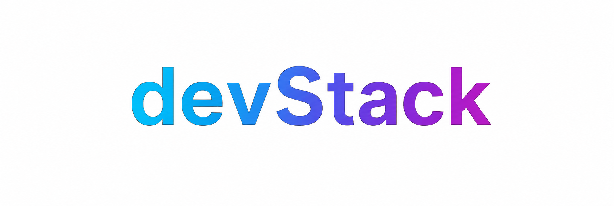

# Projeto Integrador 

## Orientações 

1. **FORK** - Apenas **1 Integrante deve realizar o Fork**
2. Adicionar todos os integrantes como colaboradores no repositório
3. Utilize esta estrutura para manter seu projeto organizado e facilitar o trabalho colaborativo dos colegas.

## Sobre este Template

Este template foi desenvolvido para padronizar a organização dos trabalhos das turmas de Desenvolvimento de Sistemas. 

### Semestre: 2026/1

### Orientadores: 
- Patrocionador [@Joao-Meyer](https://github.com/Joao-Meyer)
- Staff Software Engineer Frontend [@fernandoleonid](https://github.com/fernandoleonid)
- Staff Software Engineer Backend [@marcelnt](https://github.com/marcelnt)
- Gestor do Projeto Sênior [@yurikomuta](https://github.com/yurikomuta)

### Organização

├── 📂 docs              
│   └── 📄 Kick-Off (orientações do trabalho)   
│   └── 📄 protótipos
│   └── 📄 TAP (formato WIKI)  
│   └── 📄 LER.docx    
├── 📂 code

│   └── 📂 banco   
│   └── 📂 backend   
│   └── 📂 frontend  
├── 📂 referências              
│   └── 📄 bibliografia.bib

## Escopo mínimo
O projeto deverá apresentar:
- Landing Page responsiva 
- Catálogo de produtos 
- Organização por categorias 
- Página de detalhes dos produtos 
- Área administrativa 
- Integração frontend + backend 
- Persistência em banco de dados

## Tecnologias 
- Frontend (HTML, CSS e JS sem uso de frameworks)
- Backend (Node.js)
- Banco ( MySQL)
- Projetos (Github)
- Integração (API REST)
  
_Obs.: Outros frameworks, bibliotecas e ferramentas podem ser utilizadas, desde que aprovadas previamente pelos professores._

## Entrega
Cada grupo deverá apresentar:
- Fork do modelo de repositório do github disponibilizado pelos professores, não pode faltar:
- Descrição do projeto 
- Integrantes da equipe 

### Tecnologias utilizadas
- Link do Projeto frontend
- Link do Projeto backend
- Link do Projeto Banco de dados
- Link do video pitch (5 minutos apresentando o projeto) - publicado no Youtube. 

### Roteiro:
- Criação do fork do repositório conforme o programa/software/app.
- Criação da TAP (Termo de Abertura de Projeto) | certidão de nasc.
- Validação da TAP.
- Criar o Projeto (GitHub Projects)
- Criação de Issues (tasks)
- Atrelar os responsáveis (Quem responde pela Task) Assign
- Criar os marcos (milestones)
- Anexar as issues ao Project 
- Organizar as issues no Roadmap(Diagrama de Gantt)
- **Todos** devem realizar registro as Dailys Scrum nas issues

**_Obs.: Lembrar sempre ao executar cada issues (movida no kanban), quando for finalizada deve ser fechada/mergeada(#PR)._**

## Contribuições

Use mensagens claras e descritivas!

Commits pequenos e frequentes.

Exemplo: git commit -m `[funcionalidade] integração route ./login `

## Authors

- [@fernandodeSá](https://www.github.com/Fernando-68)
- [@matheuslucas](https://www.github.com/suehtam6)
- [@alicecampos](https://www.github.com/trixiealice)
- [@brunohaddad](https://www.github.com/Alveszx1)

## Repositórios de Back e Front (+ Link do Figma)

- Back-end: https://github.com/Fernando-68/Back-end_honeydukes
- Front-end (cliente): https://github.com/Fernando-68/Front-end_honeydukes
- Front-end (admin): https://github.com/Fernando-68/Front-end_honeydukes-gestao
- Protótipo Figma: https://www.figma.com/design/rm0e2OfZZHG7EUjxemnuok/HoneyDuke-s?node-id=0-1&p=f&t=UhRsF76ewY1XeZ8l-0
